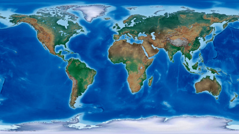
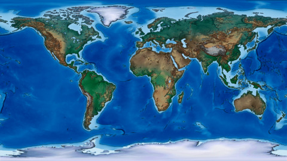
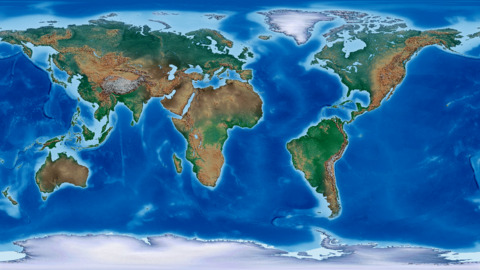
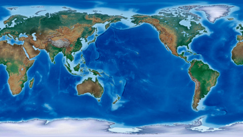
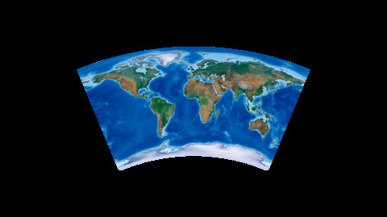
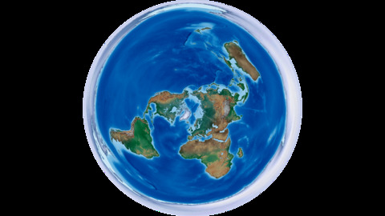
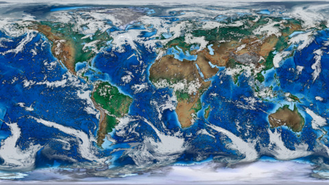

# ImageMagick for Mapmakers

Use ImageMagick to create, edit, compose or convert digital images. This is a growing list of my most used ImageMagick commands that extend and enhance mapmaking.

## The Magick

Adjust levels to enhance colors of Natural Earth's hypsometric image. This will be our example image.  
```convert HYP_HR_SR_OB_DR.png -level 50%,100% hyp.png```




Resize all png files by 25% and save as jpg. These will be our example thumbnails.  
```ls *.png | while read file; do convert -resize 25% ${file} ${file%.*}.jpg; done```

Add a sketch effect with a canny edge detection layer.  
```convert hyp.png \( +clone -modulate 200 -canny 0x1+10%+20% -negate \) -gravity center -compose multiply -composite hyp_canny.png```



Crop image.  
```convert hyp.png -gravity center -crop 960x540+0+0 +repage hyp_crop.png```

Split image by percentage and save parts.  
```convert hyp.png -crop 25%x100% +repage hyp_part.png```

Append split images in reverse order and flip horizontally.  
```convert $(ls -r hyp_part-*.png) -flop +append hyp_append.png```



Change the prime meridian 180*.  
```convert hyp.png -roll +960 hyp_roll.png```



Apply a 45* arc projection.  
```convert -size 1920x1080 xc:none \( hyp.png -virtual-pixel none -resize 50% -distort Arc '45' \) -gravity center -compose over -composite hyp_arc_45.png```



Apply a 45* arc projection rotated 180*.  
```convert -size 1920x1080 xc:none \( hyp.png -virtual-pixel none -resize 50% -rotate 180 -distort Arc '45 180' \) -gravity center -compose over -composite hyp_arc_45_180.png```


Apply a polar projection.  
```convert -size 1920x1080 xc:none \( hyp.png -virtual-pixel none -resize 50% -distort Polar '0' \) -gravity center -compose over -composite hyp_polar_0.png```



Composite cloud cover image over Natural Earth image.  
```convert hyp.png tcdc.png -gravity center -compose over -composite hyp_tcdc.png```

Composite and adjust levels of each image in one command.  
```convert -size 1920x1080 xc:none \( hyp.png -level 50%,100% \) -gravity center -compose over -composite \( tcdc.png -level 50%,100% \) -gravity center -compose over -composite hyp_tcdc.png```



Make a gif from a folder of files.  
```convert -delay 60 $PWD/*.png $(basename $PWD).gif```

TO DO:

gif examples...

adding text captions...

creating a grid of map images...

...
