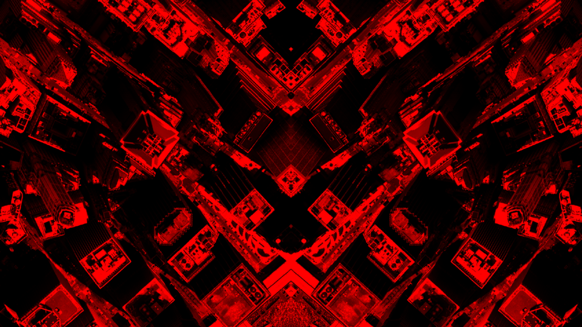

# ImageMagick for Mapmakers

This is a work in progress compiling my most used ImageMagick commands that extend and enhance the mapmaking process.



Use `gdalwarp` to convert geotiff to regular tiff for use with imagemagick.
 
```gdalwarp -overwrite -dstalpha --config GDAL_PAM_ENABLED NO -co PROFILE=BASELINE layer_geo.tif layer_regular.tif```

Adjust levels to enhance colors of Natural Earth's hypsometric raster.

```convert HYP_HR_SR_OB_DR.tif -level 50%,100% HYP_HR_SR_OB_DR_levels.tif```

Composite cloud cover raster over Natural Earth raster using `over` blend mode.

```convert layer0.tif layer1.tif -gravity center -compose over -composite layer_composite.tif```

Resize, adjust levels and composite rasters (with background canvas) in one command.

```convert -size ${width_frame}x${height_frame} xc:none \( layer0.tif -resize ${resize}% -level 50%,100% \) -gravity center -compose over -composite \( layer1.tif -resize ${resize}% -level 50%,100% \) -gravity center -compose over -composite layer_composite.tif```
