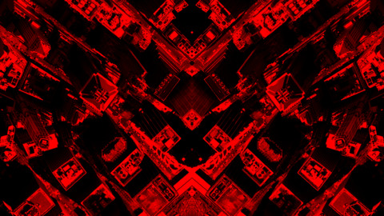
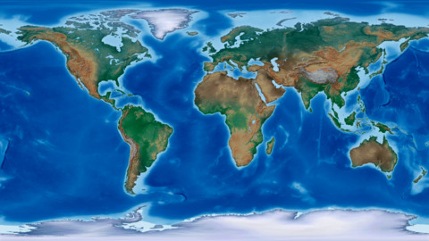
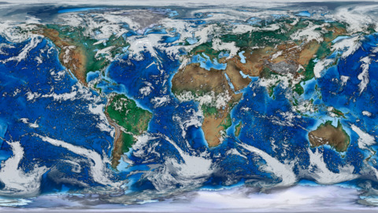

# ImageMagick for Mapmakers

This is a work in progress compiling my most used ImageMagick commands that extend and enhance the mapmaking process.



Use `gdalwarp` to convert geotiff to regular tiff for use with imagemagick.
 
```gdalwarp -overwrite -dstalpha --config GDAL_PAM_ENABLED NO -co PROFILE=BASELINE layer_geo.tif layer_regular.tif```

Crop image.

```convert largeprint_kdp-page077.png -gravity center -crop 1940x600+0+0 +repage largeprint_kdp-page077_1940x600.png```

Crop image while maintaining aspect ratio with `geometry` option.

```convert largeprint_kdp-page077.png -gravity center -geometry 1940x600^ -crop 1940x600+0+0 +repage largeprint_kdp-page077_1940x600.png```

Resize all image files.

```ls *.png | while read file; do convert -resize 25% ${file} ${file%.*}.jpg; done```

Adjust levels to enhance colors of Natural Earth's hypsometric raster.

```convert HYP_HR_SR_OB_DR.tif -level 50%,100% HYP_HR_SR_OB_DR_levels.tif```




Composite cloud cover raster over Natural Earth raster.

```convert layer0.tif layer1.tif -gravity center -compose over -composite layer_composite.tif```

Resize, adjust levels and composite rasters (with background canvas) in one command.

```convert -size 480x270 xc:none \( layer0.tif -resize 25% -level 50%,100% \) -gravity center -compose over -composite \( layer1.tif -resize 25% -level 50%,100% \) -gravity center -compose over -composite layer_composite.tif```



Add a sketch effect with a canny edge detection layer.

```convert layer0.png -level 50%,100% \( +clone -modulate 200 -canny 0x0+5%+30% -negate \) -compose multiply -composite layer0_canny.png```


Make a gif from a folder of files.

```convert -delay 60 $PWD/*.png $(basename $PWD).gif```

TO DO: more effects and animation
