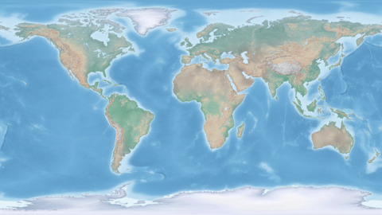
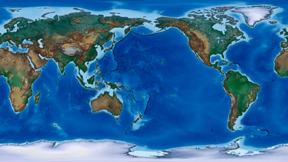

# ImageMagick for Mapmakers

This is an ongoing project to compile the choicest ImageMagick commands I've used over the years to extend and enhance my mapmaking. I hope you'll find some of them useful in your work.


Adjust levels to enhance colors of Natural Earth's hypsometric image. This will be our example image.

```convert HYP_HR_SR_OB_DR.png -level 50%,100% layer0.png```




Resize all png files by 25% and save as jpg. These will be our example thumbnails.

```ls *.png | while read file; do convert -resize 25% ${file} ${file%.*}.jpg; done```

Crop image.

```convert layer0.png -gravity center -geometry 1940x600^ -crop 1940x600+0+0 +repage layer0_crop.png```

Crop image by percentage.

```convert layer0.png -crop 50%x100% +repage layer0_half.png```

Append 


Composite cloud cover image over Natural Earth image.

```convert layer0.png layer1.png -gravity center -compose over -composite frame.png```

Composite and adjust levels of each image in one command.

```convert -size 1920x1080 xc:none \( layer0.png -level 50%,100% \) -gravity center -compose over -composite \( layer1.png -level 50%,100% \) -gravity center -compose over -composite frame.png```


Add a sketch effect with a canny edge detection layer.  
```convert layer0.png \( +clone -modulate 200 -canny 0x1+10%+20% -negate \) -compose multiply -composite layer0_canny.png```


Change the prime meridian 180*.  
```convert layer0_canny.png -roll +960 layer0_roll960.png```



Make a gif from a folder of files.

```convert -delay 60 $PWD/*.png $(basename $PWD).gif```

